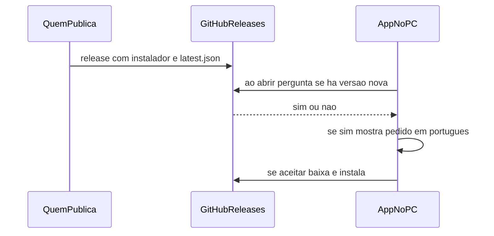

# Planejamento — atualização do app

Como o Pomodoro instalado no Windows **pede atualização** em cada computador. Lei curta: [AGENTS.md](./AGENTS.md). Produto/timer: [PLANEJAMENTO.md](./PLANEJAMENTO.md). Stack: skill `produto-pomodoro`.

Isto é o plano **já ligado no código** (plugin updater + diálogo ao abrir). Authenticode e workflow automático de Release continuam TBD.

## Objetivo

Publicar uma versão nova **uma vez**. Em **todo PC** que tiver o app instalado por este instalador, na próxima abertura (com internet), o programa **pede** para atualizar — não exige ir de máquina em máquina com um `.exe` novo.

O Windows **não empurra** o arquivo. O app **consulta** um endereço: se houver versão maior, mostra o aviso.

## Fechado neste plano

- Canal: **GitHub Releases** do repo `Pomodoro` (já existe remote). Sem servidor próprio, Render, Docker ou loja da Microsoft.
- Mecânica: plugin **updater do Tauri 2**.
- Vale só para quem instalou pelo **NSIS/MSI** com updater ligado. `.exe` solto copiado à mão **não** entra.
- Copy do aviso em **português**.
- O usuário **confirma** antes de baixar/instalar. Recusar continua na versão atual. Sem instalação silenciosa e sem fechar o timer no meio do foco sem aviso.
- Sem login. Sem banco. Artefatos públicos no Release (instalador + manifesto de versão).

## Como funciona

1. Sobe a versão no `tauri.conf` / `package.json`.
2. `tauri build` gera o instalador **assinado** (chave do updater Tauri).
3. Cria um **GitHub Release** com o instalador e o `latest.json` (versão, URL, assinatura).
4. Cada app instalado, **ao iniciar**, lê esse JSON. Versão remota > local → diálogo.
5. Aceitar: baixa, instala, reabre. Recusar: segue o dia; pergunta de novo na próxima abertura (enquanto a versão remota for maior).

PC **offline**: não vê o aviso. Não é falha.

## Segredos e assinatura

- Chave **privada** do updater: **não** commitir. Só env (local / GitHub Actions secrets).
- Chave **pública**: no `tauri.conf` (pode ir no git).
- Certificado Authenticode da Microsoft: **TBD**. Sem ele o SmartScreen pode avisar “Windows protegeu o PC”; o update Tauri ainda funciona.

## UX

- Checagem **ao abrir** a janela principal. Sem checar a cada minuto.
- Diálogo: há uma atualização; o que mudou se o Release tiver notas; botões **Atualizar** e **Agora não**.
- Não abrir o diálogo por cima do **backdrop ao zerar** (esperar o overlay fechar, ou só na próxima abertura).
- Durante o download: estado visível (“Baixando atualização…”). Falha de rede: mensagem em português; o timer continua.

## Fora deste plano

- Forçar atualizar ou o app não abre.
- Microsoft Store / MSIX.
- Servidor próprio, CDN pago, auto-update “push” (WNS).
- Atualizar PCs que nunca usaram este instalador.

## Ordem quando for implementar

1. ~~Gerar par de chaves do updater; gravar privada só em secret; pública no conf.~~
2. ~~Ligar `@tauri-apps/plugin-updater` + diálogo em português.~~
3. ~~Endpoint `latest.json` no GitHub Releases (URL estável do latest).~~
4. ~~Documentar no README: bump de versão, build, publicar Release, o que colar no JSON.~~
- (Opcional) workflow na `main` / tag `v*` que faz build + release. CI hoje é lint + unitários; o agente **já** publica ao pedido (skill `publicar-release`). Actions no GitHub **só** se o usuário pedir.

## Pedido: publicar release

Quando o usuário pedir para **publicar release** (ou soltar versão / gerar atualização), o agente faz **os 4 passos**, sem deixar o upload no GitHub para o usuário. Detalhe: skill `publicar-release`.

1. Subir a versão nos três arquivos (`package.json`, `src-tauri/tauri.conf.json`, `src-tauri/Cargo.toml`; lock do crate `pomodoro` se precisar). Patch (`x.y.Z+1`), salvo outro número pedido.
2. `tauri build` assinado: `TAURI_SIGNING_PRIVATE_KEY` = conteúdo de `.tauri-updater.key` (não commitir a chave; o `tauri build` **não** lê `_PATH`).
3. Gerar `latest.json` na pasta NSIS (versão, URL `.../releases/download/vX.Y.Z/Pomodoro_X.Y.Z_x64-setup.exe`, texto do `.sig`).
4. Publicar o GitHub Release (`gh release create`, tag `vX.Y.Z`, sem draft/pre-release) com **só** o `.exe` novo, o `.sig` e o `latest.json`. Devolver a URL. Não instalar o `.exe` novo neste PC.

Commit da versão: só se o usuário pedir (vale a decisão 10 do `AGENTS.md`).

## TBD

- Authenticode (certificado Windows).
- Workflow automático de Release no GitHub Actions (o agente já publica ao pedido).
- Texto das notas de versão (changelog no diálogo vs só “há uma atualização”).
