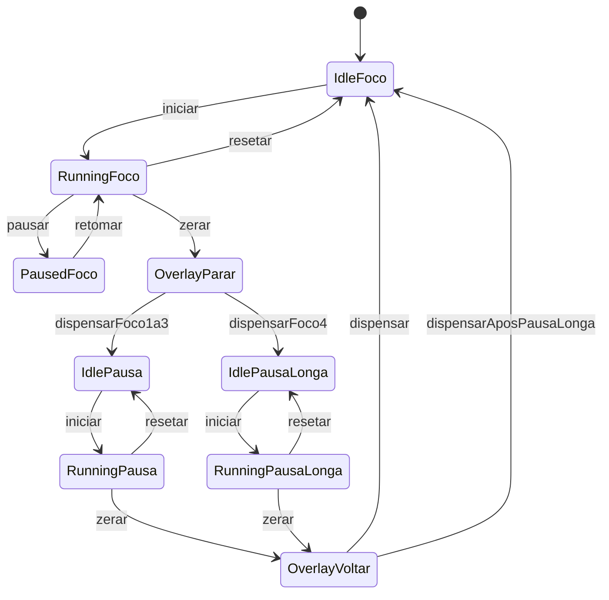

# Planejamento — Pomodoro

Fonte do plano de produto e da ordem de trabalho. Lei curta: [AGENTS.md](./AGENTS.md). Detalhe de timer/stack: skill `produto-pomodoro`.

**Este repo não usa Trello.** Sem board, cards ou prefixo.

## Fechado

- Produto: timer de **foco / pausa**, uso pessoal. Fora: Sunsama, backlog, calendário, Ludarium.
- UI em **português**. Vale `AGENTS-codigo.md` (testes, Husky, CI, Playwright).
- Programa **Windows** (janela nativa, `.exe` — não no navegador).
- Stack: **Tauri 2 + Vite + React + TypeScript**.
- MVP: timer clássico (iniciar, pausar, resetar; foco e pausa) e, ao zerar, **backdrop em todos os monitores** pedindo para parar + **som de alerta**.
- Pós-MVP imediato: durações editáveis, ciclo 4 focos + pausa longa, ícone flutuante arrastável ao minimizar.
- Sem login, sem banco, sem notificação toast (o interruptor é o backdrop). Durações do ciclo no `localStorage`.
- App instalado pelo NSIS consulta o GitHub Releases **ao abrir** e pede atualização (Atualizar / Agora não). Detalhe: [PLANEJAMENTO-ATUALIZACAO.md](./PLANEJAMENTO-ATUALIZACAO.md).

## Runtime

- `npm run tauri dev`: abre janela nativa (desenvolvimento).
- `npm run tauri build`: gera `.exe` / instalador (NSIS ou MSI).
- Rust só no *shell* (janela, monitores, overlay). Precisa de `rustup` no Windows. Se Rust for bloqueio: Electron, ainda como `.exe`.
- Next.js não cabe neste shell.

**Fora do MVP:** banco, auth, Docker, fila, histórico, bandeja do sistema. Atualização em cada PC: [PLANEJAMENTO-ATUALIZACAO.md](./PLANEJAMENTO-ATUALIZACAO.md) (GitHub Releases + updater Tauri).

## Comportamento do MVP

Lógica pura em TypeScript (testável sem abrir a janela). Relógio de parede (`Date.now`), não só `setInterval`.

- **Resetar** volta o modo atual ao tempo cheio, sem pular de modo/ciclo e sem abrir o backdrop.
- Durações editáveis na configuração. Iniciais: **25 min foco / 5 min pausa / 15 min pausa longa**.
- Ciclo: (foco + pausa) × 3, depois 4º foco + pausa longa.

### Ao zerar

- Cobre cada monitor no tamanho da tela do Windows (incluindo a barra de tarefas).
- Backdrop **50% transparente**, com animação ao abrir.
- Fim do foco: copy pedindo para **parar**. Fim da pausa: pedir para **voltar ao foco**.
- Dá para editar o **próximo** título do overlay (ícone na tela do timer); depois do aviso, volta o padrão.
- Som de alerta ao aparecer. Clássicos + pacote Notifications (CC0); som, altura e loop por modo na configuração (loop até Entendi).
- **Entendi** fecha o overlay e mostra o próximo modo **parado** (Iniciar pausa / Iniciar foco).
- **Pular** na tela do timer avança o modo atual sem esperar o tempo e sem overlay.

Identidade visual: ícone **tomate com relógio**; janela no modelo de referência (fundo escuro, anel coral, botão-pílula). Overlay com contraste alto.

## Ordem de trabalho

Sem cards. Fatias neste chat (ou `pomodoro-dev`). Commit só se o usuário pedir. Testes unitários + E2E entram na feature (`AGENTS-codigo`); `npm test` / E2E no chat só se pedido ou ao criar os testes da fatia.

1. ~~Gravar este planejamento no repo.~~
2. ~~Scaffold Windows: Tauri 2 + Vite + React + TS, janela nativa, Husky, Playwright, CI na `main`, README (`rustup`, `tauri dev`, `tauri build`).~~
3. ~~Domínio do timer (estados, durações iniciais, unitários).~~
4. ~~Tela: tempo, modo, iniciar / pausar / resetar.~~
5. ~~Interruptor: overlay em todos os monitores + som.~~
6. Configuração dos ciclos (foco / pausa / pausa longa) + ícone flutuante arrastável ao minimizar.

## Depois do MVP

- Histórico.
- Bandeja / continuar com a janela fechada.
- Atalho extra no menu Iniciar / área de trabalho além do que o instalador Tauri já criar.

## TBD

- Electron só se Rust for bloqueio.
