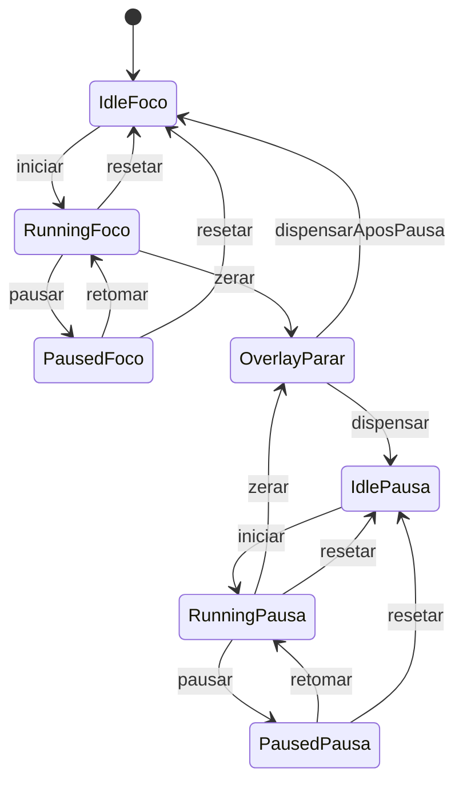

# Planejamento — Pomodoro

Fonte do plano de produto e da ordem de trabalho. Lei curta: [AGENTS.md](./AGENTS.md). Detalhe de timer/stack: skill `produto-pomodoro`.

**Este repo não usa Trello.** Sem board, cards ou prefixo.

## Fechado

- Produto: timer de **foco / pausa**, uso pessoal. Fora: Sunsama, backlog, calendário, Ludarium.
- UI em **português**. Vale `AGENTS-codigo.md` (testes, Husky, CI, Playwright).
- Programa **Windows** (janela nativa, `.exe` — não no navegador).
- Stack: **Tauri 2 + Vite + React + TypeScript**.
- MVP: timer clássico (iniciar, pausar, resetar; foco e pausa) e, ao zerar, **backdrop em todos os monitores** pedindo para parar + **som de alerta**.
- Sem persistência, sem login, sem notificação toast (o interruptor é o backdrop).

## Runtime

- `npm run tauri dev`: abre janela nativa (desenvolvimento).
- `npm run tauri build`: gera `.exe` / instalador (NSIS ou MSI).
- Rust só no *shell* (janela, monitores, overlay). Precisa de `rustup` no Windows. Se Rust for bloqueio: Electron, ainda como `.exe`.
- Next.js não cabe neste shell.

**Fora do MVP:** banco, auth, Docker, fila, hospedagem, histórico, durações editáveis, bandeja do sistema.

## Comportamento do MVP

Lógica pura em TypeScript (testável sem abrir a janela). Relógio de parede (`Date.now`), não só `setInterval`.

- **Resetar** volta o modo atual ao tempo cheio, sem pular de modo e sem abrir o backdrop.
- Durações **ainda não são lei**. Valores iniciais no código: **25 min foco / 5 min pausa**. Sem pausa longa neste MVP.

### Ao zerar

- Uma janela por monitor: fullscreen, always-on-top, backdrop escuro cobrindo a barra de tarefas.
- Fim do foco: copy pedindo para **parar**. Fim da pausa: pedir para **voltar ao foco**.
- Som de alerta ao aparecer (um toque + overlay até o clique, salvo pedido de loop).
- Botão para dispensar (ex.: “Entendi” / “Começar a pausa”). O próximo modo **não** inicia sozinho.

Identidade visual: **TBD**. UI limpa; overlay com contraste alto. Não inventar paleta “genérica AI” como marca.

## Ordem de trabalho

Sem cards. Fatias neste chat (ou `pomodoro-dev`). Commit só se o usuário pedir. Testes unitários + E2E entram na feature (`AGENTS-codigo`); `npm test` / E2E no chat só se pedido ou ao criar os testes da fatia.

1. ~~Gravar este planejamento no repo.~~
2. ~~Scaffold Windows: Tauri 2 + Vite + React + TS, janela nativa, Husky, Playwright, CI na `main`, README (`rustup`, `tauri dev`, `tauri build`).~~
3. ~~Domínio do timer (estados, durações iniciais, unitários).~~
4. ~~Tela: tempo, modo, iniciar / pausar / resetar.~~
5. ~~Interruptor: overlay em todos os monitores + som.~~

## Depois do MVP

- Durações ajustáveis, pausa longa, histórico.
- Bandeja / continuar com a janela fechada.
- Paleta e tipografia.
- Atalho extra no menu Iniciar / área de trabalho além do que o instalador Tauri já criar.

## TBD

- Confirmar 25/5 como lei ou só valor inicial.
- Som em loop vs um toque.
- Visual.
- Electron só se Rust for bloqueio.
